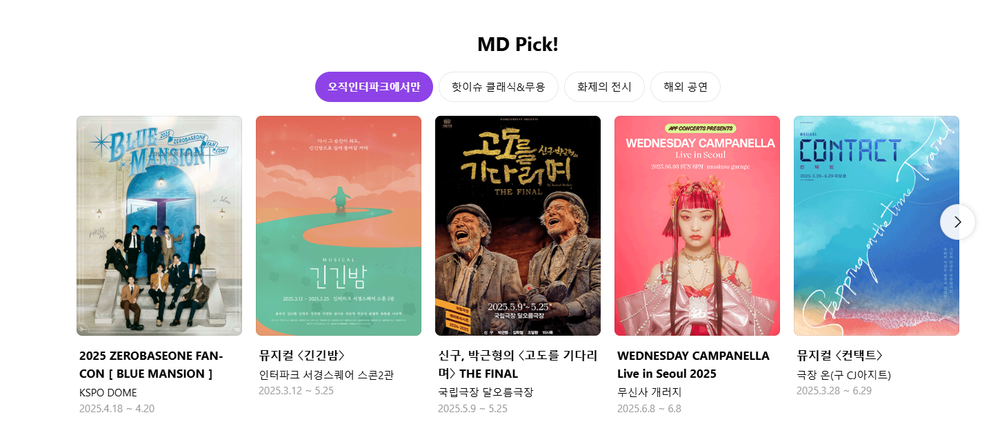
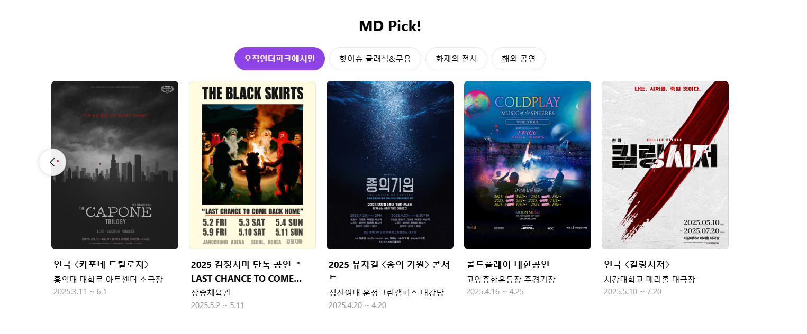

🎯 목표: 인터파크 스타일 포털형 공연 슬라이드 웹앱
프로젝트 이름: InterTicket

# 🎟️ InterTicket

공연, 전시, 콘서트, 그리고 당신의 티켓까지.  
**인터파크 스타일의 공연 예매 포털**을 재현한 미니 프로젝트입니다.

(./public/images/interpark.png) <!-- 대표 이미지 경로 조정 가능 -->

---

## 🚀 주요 기능

- 🎯 **MD Pick 슬라이드**: 공연 5개씩 한 페이지, 부드러운 슬라이드 전환
- 🎨 **카테고리 필터 버튼**: '오직인터파크에서만', '화제의 전시' 등
- 🖼️ **포스터 중심 UI**: 카드형 공연 정보 구성
- ⚙️ **React + Vite + TailwindCSS 기반**

---

## 💻 사용 기술

| 역할 | 기술 스택 |
|------|-----------|
| 프레임워크 | `React`, `Vite` |
| 스타일링 | `TailwindCSS` |
| 슬라이드 구현 | `useState` + `translateX + transition` |
| 프로젝트 관리 | `npm`, `Git`, `GitHub` |

---

## 📂 프로젝트 구조

InterTicket/ ├── public/ # 이미지 파일 ├── src/ │ ├── components/ # MdPickSection.jsx │ ├── data/ # mdPickList.js (공연 정보) │ ├── App.jsx │ ├── main.jsx │ └── index.css ├── .gitignore ├── package.json ├── tailwind.config.js └── vite.config.js

---

## 🌟 구현 포인트

- `translateX`와 `transition`을 활용한 **스르륵 애니메이션 슬라이드**
- 한 페이지에 **정확히 5개 카드**만 깔끔하게 출력되도록 너비 계산
- TailwindCSS로 빠르고 일관성 있는 디자인

---

## 📸 시연 화면

| 슬라이드 전환 전                                   | 슬라이드 전환 후                                 |
|---------------------------------------------|-------------------------------------------|
|  |  |

---

## ✍️ 만든 사람

| 이름 | GitHub |
|------|--------|
| 박기영 | [@Nightingale2014](https://github.com/Nightingale2014) |

---

## 🤍 앞으로 확장 예정

- [ ] 상세 페이지 연결
- [ ] 공연 검색 및 필터 기능
- [ ] 반응형 모바일 UI
- [ ] 실제 API 연동

---

> **“티켓 그 이상의 경험을 만드는 중입니다.”**

